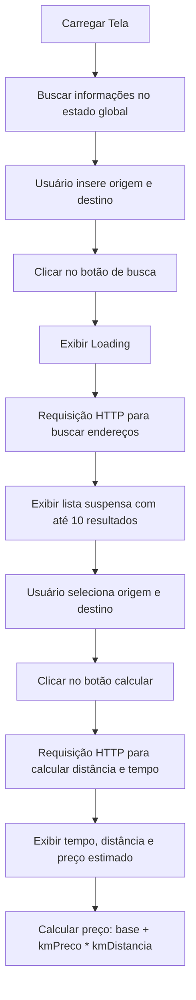

# 🚖 TaxiCalc

## Tecnologias Utilizadas

O projeto foi desenvolvido utilizando as seguintes tecnologias:

- [Expo](https://expo.dev/)
- [React Native](https://reactnative.dev/)
- [TypeScript](https://www.typescriptlang.org/)
- [Async Storage](https://react-native-async-storage.github.io/async-storage/)
- [React Navigation](https://reactnavigation.org/)
- [Zustand](https://zustand-demo.pmnd.rs/)
- [Lottie](https://lottiefiles.com/)

## Estrutura do Projeto

A organização das pastas no diretório `src/` segue o seguinte padrão para facilitar o desenvolvimento e a manutenção:

- **`assets/`**: Contém imagens e outros recursos utilizados no projeto.
- **`components/`**: Armazena componentes reutilizáveis em várias partes do aplicativo.
- **`context/`**: Define os contextos compartilhados dentro do aplicativo.
- **`screens/`**: Contém as telas principais da aplicação.
- **`services/`**: Implementa a lógica de serviços, como chamadas a APIs.
- **`store/`**: Configuração do Zustand para gerenciamento de estado global com persistência via AsyncStorage.
- **`types/`**: Define tipos e interfaces utilizados em todo o projeto.
- **`utils/`**: Contém funções utilitárias que auxiliam nas operações gerais do projeto.

## Fluxos Funcionais

### Fluxo Padrão e Configuração

1. **Verificação Inicial**:

- Ao carregar o aplicativo, verifica-se se há dados salvos no AsyncStorage.
- Caso não haja dados, os valores padrão são utilizados.

2. **Persistência de Dados**:

- Qualquer alteração nos dados é refletida imediatamente no estado global e armazenada no AsyncStorage.
- Este mecanismo permite que as informações estejam disponíveis em qualquer parte do aplicativo.

3. **Depuração**:

- Durante o desenvolvimento, é possível utilizar a
  extensão [Redux DevTools](https://chromewebstore.google.com/detail/redux-devtools/lmhkpmbekcpmknklioeibfkpmmfibljd)
  para depuração do estado global.

### Cálculo de Preços Estimados

O cálculo do preço da corrida é feito com a fórmula:

`base + (kmPreco * kmDistancia)`

Onde:

- `base` é o valor inicial da tarifa.
- `kmPreco` é o custo por quilômetro percorrido.
- `kmDistancia` é a distância entre o ponto de origem e o destino.

#### Fluxos:

#### Passos:

1. **Configuração Inicial**:

- As informações de tarifa são carregadas do estado global e podem ser ajustadas pelo usuário nas configurações.

2. **Busca de Endereços**:

- O usuário insere os endereços de origem e destino.
- Ao clicar no botão de busca, uma requisição HTTP é feita para retornar até 10 sugestões de endereços.
- Um indicador de carregamento é exibido enquanto a busca ocorre.

3. **Seleção de Endereços**:

- Após a busca, o usuário escolhe os endereços desejados em uma lista suspensa.
- Cada item da lista inclui endereço completo, código postal e coordenadas geográficas.

4. **Cálculo do Preço**:

- Com os endereços selecionados, uma nova requisição HTTP é feita para calcular a distância e o tempo entre os pontos.
- O resultado exibe:
    - Tempo estimado da corrida.
    - Distância total.
    - Preço estimado da corrida.

## Dados de Referência

As tarifas de táxi utilizadas neste aplicativo são baseadas nos seguintes recursos:

- [Taxa Rio de Janeiro](https://www.pt.taxi-calculator.com/taxi-rate-rio-de-janeiro/343)
- [Taxa Oficial da Prefeitura do Rio de Janeiro](https://carioca.rio/servicos/informacoes-sobre-tarifas-de-taxi/)

