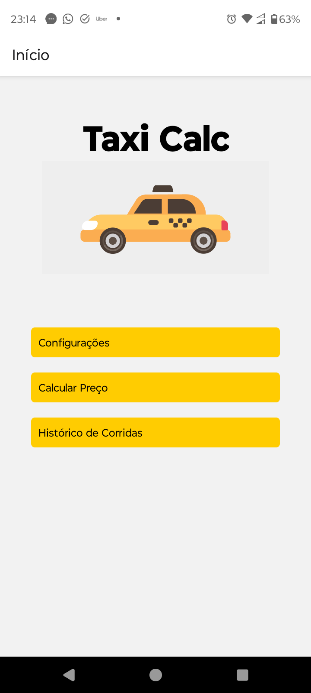
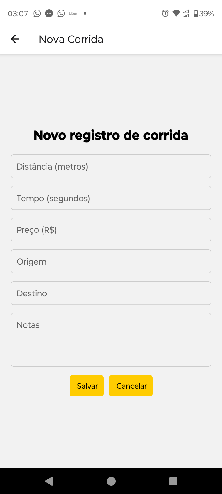
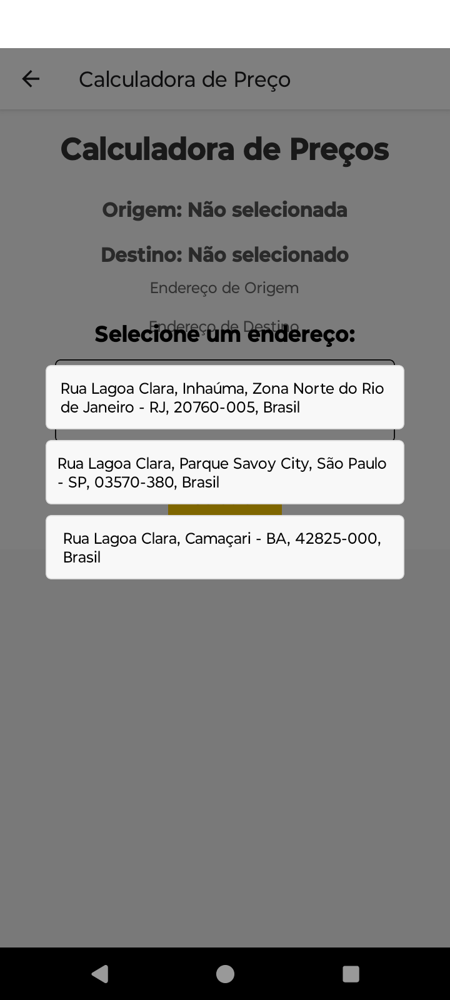
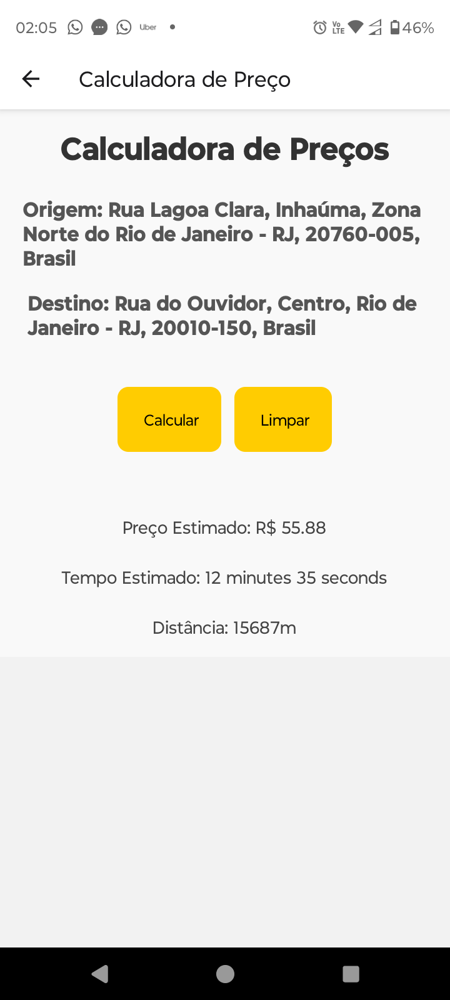
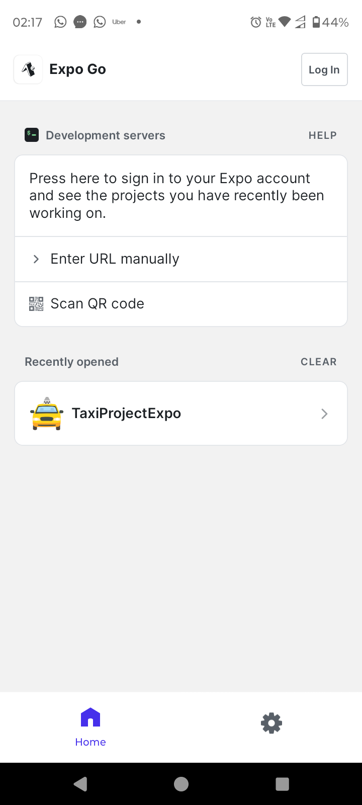
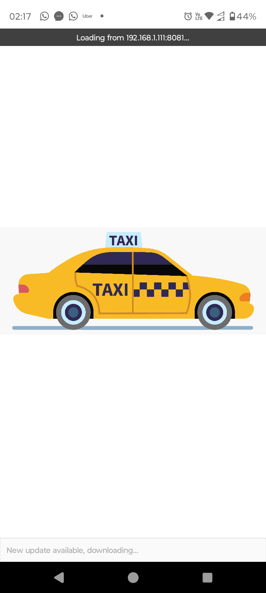
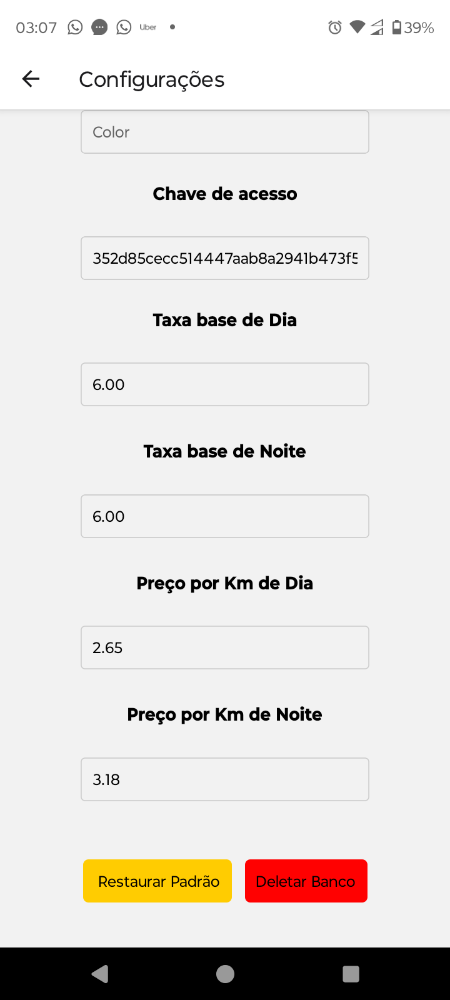
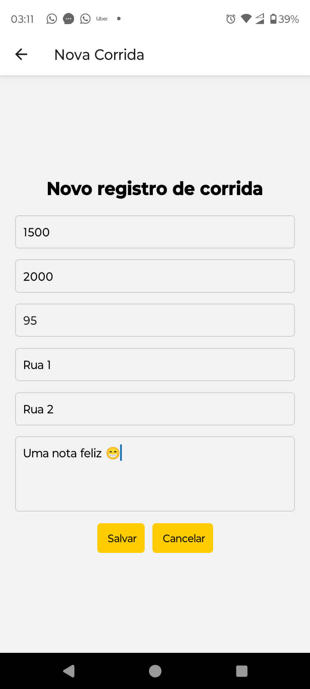
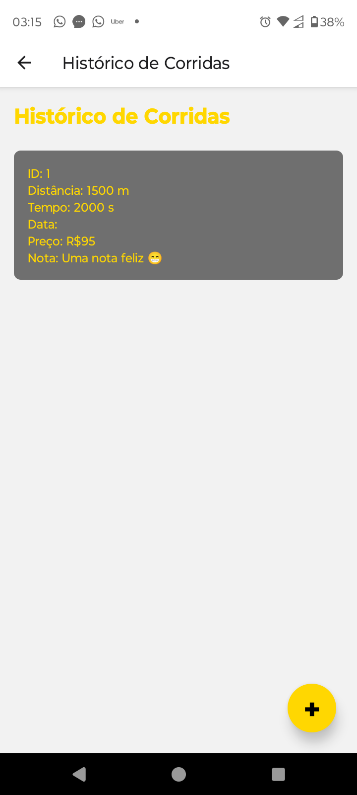

# 🚖 Taxi Calc

## Trabalho Acadêmico de Conclusão de Curso - Graduação em Ciência da Computação

### Roteiro de Extensão de Programação para Dispositivos Móveis em Android

Este projeto visa o desenvolvimento de um aplicativo móvel para taxistas, com funcionalidades de controle de corridas e
cálculo de valores aproximados de tarifas, com o intuito de melhorar a organização financeira dos profissionais e
usuários do serviço de táxi.

### Diagnóstico e Teorização

#### Identificação das Partes Envolvidas

Este projeto envolve taxistas ao redor do Shopping Nova América e usuários do serviço de táxi, com o objetivo de atender
às necessidades específicas deste público.

#### Situação-Problema

Foi identificado a ausência de um aplicativo que atendesse tanto aos taxistas quanto aos usuários, permitindo o registro
de corridas e a análise de consumo e receita. Além disso, a ferramenta busca oferecer aos usuários a possibilidade de
calcular o valor aproximado das corridas previamente.

#### Demanda Sociocomunitária e Motivação Acadêmica

O projeto visa desenvolver um aplicativo Android de controle de corridas para taxistas, além de oferecer aos usuários
uma estimativa de custo das corridas, facilitando a gestão financeira tanto para os motoristas quanto para os
passageiros.

#### Objetivos

- Desenvolver um aplicativo Android para controle de corridas e cálculo de tarifas.
- Treinar taxistas e usuários para a utilização do aplicativo.
- Realizar um levantamento de dados para avaliar a eficácia do aplicativo até o final do semestre.

### Planejamento para Desenvolvimento do Projeto

#### Plano de Trabalho

O desenvolvimento do projeto será dividido nas seguintes etapas:

1. **Desenvolvimento do Aplicativo**: Implementação do sistema Android com funcionalidades de controle de corridas e
   cálculo de tarifas.
2. **Treinamento de Usuários e Taxistas**: Capacitação de taxistas e usuários sobre como utilizar o aplicativo.
3. **Levantamento de Dados**: Coleta de dados sobre a utilização do aplicativo para análise posterior.
4. **Análise dos Dados**: Avaliação da eficácia do aplicativo com base nos dados coletados e feedback dos usuários.

#### Envolvimento do Público Participante

O público participante será composto por taxistas e usuários do serviço de táxi, que testarão e utilizarão o aplicativo
durante o projeto.

#### Avaliação dos Resultados

Os resultados serão avaliados por meio de um questionário de satisfação direcionado a usuários e taxistas, além de um
levantamento de dados para medir a eficácia do aplicativo.

### Encerramento do Projeto

#### Relato da Experiência

O desenvolvimento deste projeto foi uma experiência enriquecedora, permitindo a aplicação prática dos conhecimentos
adquiridos ao longo do curso. Foi uma oportunidade de expandir minhas habilidades em desenvolvimento Android, além de
contribuir com uma solução útil para a comunidade local.

#### Evidências das Atividades Realizadas

- **Código-fonte**: O repositório do projeto está disponível no
  GitHub: [Taxi Calc no GitHub](https://github.com/gabrielmoura/TrabalhoAcademicoEX)
- **Aplicativo**: A versão do aplicativo pode ser
  baixada [aqui](https://github.com/gabrielmoura/TrabalhoAcademicoEX/releases/tag/0.9.1).
- **Questionário de Satisfação**: O questionário de satisfação está
  disponível [aqui](https://github.com/gabrielmoura/TrabalhoAcademicoEX).
- **Informações Adicionais**: Outras informações podem ser encontradas em [DETAILED.md](DETAILED.md).

## Contribuição

Contribuições são bem-vindas! Sinta-se à vontade para abrir issues ou enviar pull requests.

## Capturas de Tela

| --------------     | ------------------ | ---------------    |
|--------------------|--------------------|--------------------|
|  |  |  |
|  |  |  |
|  |  |  |
